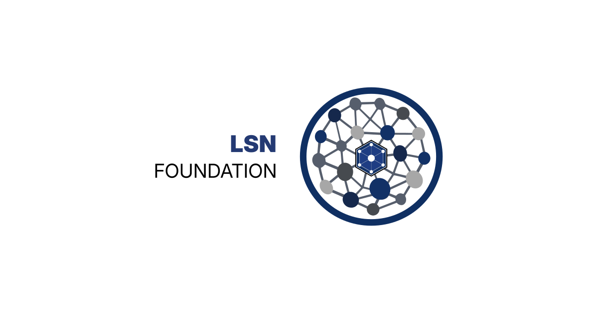

  

# LSN Foundation

Governance and stewardship of the Lattice Semantic Nexus.

The LSN Foundation is responsible for stewardship of the canonical definitions, governance processes, and long-term structural integrity of Lattice Core.

The Foundation exists to maintain continuity around the architecture while preserving the distinction between architecture, governance, research, and participation.

## Responsibilities

- Governance and stewardship
- Canonical document management
- Standards and specification processes
- Long-term architectural continuity
- Ecosystem coordination

## The Lattice Semantic Nexus

The Lattice Semantic Nexus is structured around four distinct but related functions:

- **Lattice Core** — Architecture
- **LSN Foundation** — Governance and Stewardship
- **Lattice Research Institute (LRI)** — Independent Research and Analysis
- **Lattice Community Groups (LCG)** — Participation and Community Engagement

## Learn More

- Foundation Website: https://lsn.foundation
- Ecosystem Overview: https://lsn.foundation/ecosystem/
- Lattice Core: https://latticecore.net
- Lattice Research Institute: https://lattice.institute
- Lattice Community Groups: https://latticegroups.org

---

**LSN Foundation**  
Stewardship of the Lattice Semantic Nexus

## Licensing

Unless otherwise stated, content within this repository is licensed under the Creative Commons Attribution 4.0 International License (CC BY 4.0).

See the LICENSE file for details.
